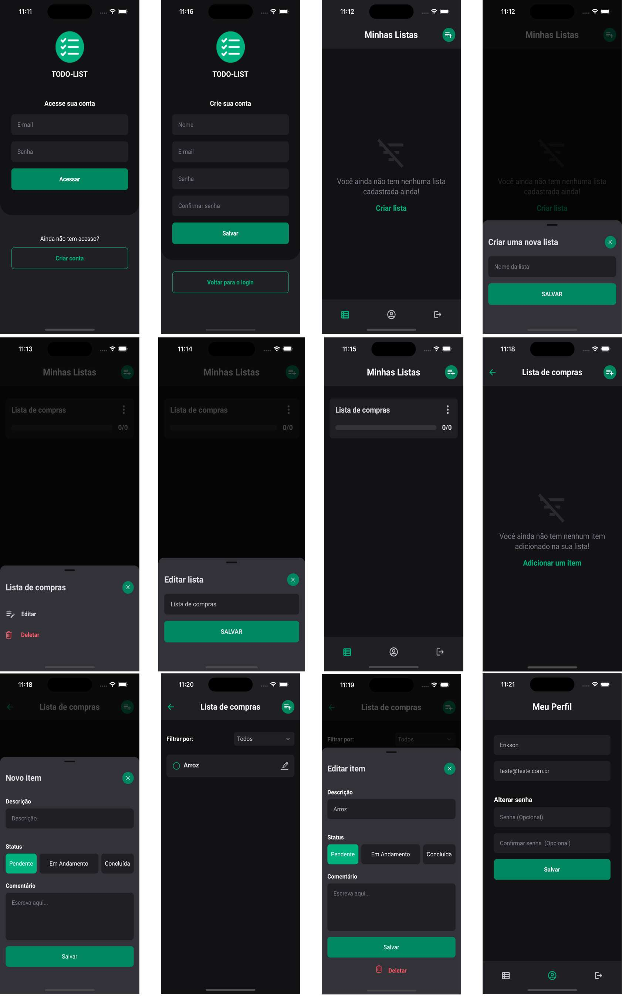

#  IBM - TODO LIST

<br>

## Tecnologias utilizadas:

- Expo
- EsLint
- Prettier
- Firebase Auth
- Firebase Firestore
- Firebase Analytics
- React Hooks Form
- React Native
- React Navigation
- Styled Components
- Typescript
- Zod
- Gemini

<br />

## Telas da aplicação

[Ver as telas](./screenshots)

<br />



<br />

## Configurações

<br />

Duplique e renomeie o arquivo `.env.example` para `.env`

Pelo terminal na raiz do projeto instale as dependências:

```
npm install
```

<br />

Esse projeto utiliza Gemini para sugerir itens para a sua lista e para isso precisa gerar uma [Chave de API](https://aistudio.google.com/app/apikey) e adicionar ao arquivo `.env`, esse passo não é obrigatório se não tiver a chave não será exibida as sugestões

<br />

## Iniciando a aplicação:

```
npm run android
npm run ios
```
